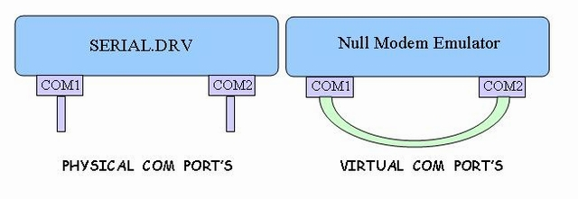
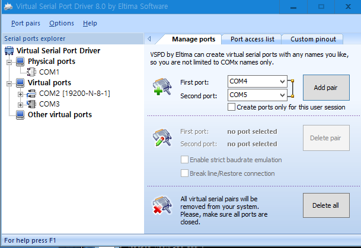
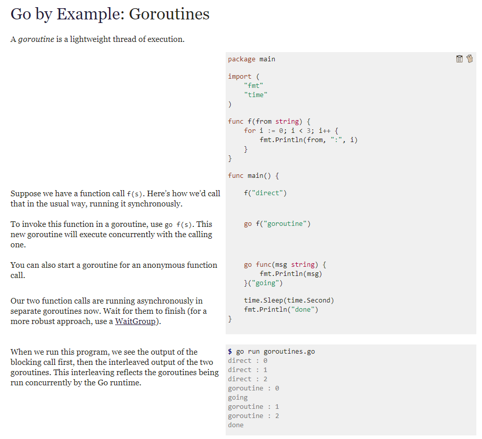

# 전자영수증 (eReceipt)
---

1. [서비스 아키텍처](#서비스-아키텍처) 
2. [가상 시리얼 포트 드라이버](#가상-시리얼-포트-드라이버) 
3. [POS](#pos-windows) 
4. [서버](#서버-ubuntu) 

---

## 서비스 아키텍처

~~~console

            virtual serial
            port driver
            - com0com, vspd
+-----+     +------+------+     +------+     +------+
| POS | --- | COM3 | COM2 |     | COM1 | --- | PRNT |
+-----+     +------+------+     +------+     +------+
                       |            |
+-----+            +------+         |        +------+
| QR  | ---------- | ESCP | --------+        | ESCP |
| -R  |            | -POS | ---------------- | -SVR |
+-----+            +------+                  +------+

~~~

구분|설명
--|--
VSPD|가상 시리얼 포트 드라이버
QR-R|QR 코드 리더기 (가입자식별)
ESCP-POS|ESC/P 명령어 중개 모듈
ESCP-SVR|ESC/P 명령어 처리 서버 모듈|

## 가상 시리얼 포트 드라이버
- 널-모뎀 에뮬레이터 (Null-modem emulator)
- 2개의 가상 COM 포트를 제공 


#### 가상시리얼 포트 드라이버 다운로드
- [com0com](http://com0com.sourceforge.net/)
- [vspd](https://www.eltima.com/vspd-post-download.html)

#### 가상시리얼 포트 드라이버 설정 화면 (예: vspd)


---

## POS (Windows)

#### ESC/P POS의 기능
기능|설명
--|--
가상 시리얼 포트 드라이버|POS와 연결할 가상 시리얼 포트 생성 (port pairing)
인증장치 연동|NFC, QR코드 리더기
인증 프록시|사용자인증 proxy 서버 역할
시리얼 I/O|시리얼 포트 데이터 입출력
프린터 릴레이|POS-프린터 명령어 중개
영수증출력제어|POS-프린터 전자/종이 영수증 출력제어

~~~console
+------+     +------+     +------+
| COM2 | --- | ESCP | --- | COM1 |
+------+     +------+     +------+ 

POS PRINT-OUT: COM2 -> COM1
PRINTER AUDIT: COM1 -> COM2
~~~

#### 쓰레드처럼 독립적인 처리 루틴 (goroutine) 활용 
- [https://gobyexample.com/goroutines](https://gobyexample.com/goroutines) 참고


~~~go

func Run(in io.ReadWriteCloser, out io.ReadWriteCloser) {
	for {
    }
}

func main() {
  var wait sync.WaitGroup
  wait.Add(2)

  in := Open(IN)
  out := Open(OUT)

  go Run(in, out)
  go Run(out, in)
  wait.Wait()
}

~~~

---

## 서버 (Ubuntu)

---

이 구문은 $$$\sqrt{3x-1}+(1+x)^2$$$ 인라인 표기법 입니다.

아래의 구문은 블럭으로 표현됩니다.

$$
\sqrt{3x-1}+(1+x)^2
$$

https://stackoverflow.com/questions/11256433/how-to-show-math-equations-in-general-githubs-markdownnot-githubs-blog


 h<sub>&theta;</sub>(x) = &theta;<sub>o</sub> x + &theta;<sub>1</sub>x

 

 

 $ \sum_{\forall i}{x_i^{2}} $

 This math is inline $`a^2+b^2=c^2`$.

This is on a separate line

```math
a^2+b^2=c^2
```